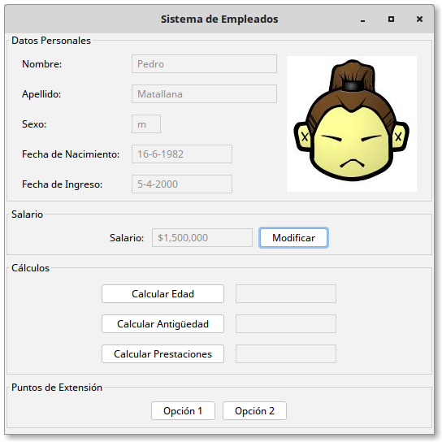

# Descripción

## Enunciado

Se quiere una aplicación que permita manejar la información de un empleado.
El empleado tiene nombre, apellido, sexo, fecha de nacimiento y una imagen asociada.
Además, como trabaja en una determinada compañia tiene una fecha de ingreso a la
misma y un salario básico asignado.

En la aplicación se puede (1) modificar el salario del empleado y (2) realizar
cálculos con la información disponible:
(a) edad actual, (b) antigüedad en la empresa y (c) prestaciones a las que tiene
derecho.
Para el cálculo de las prestaciones se utiliza la fórmula p = ( a * s ) / 12
(p: prestaciones, a: antigüedad, s: salario).

## Interfaz

    

